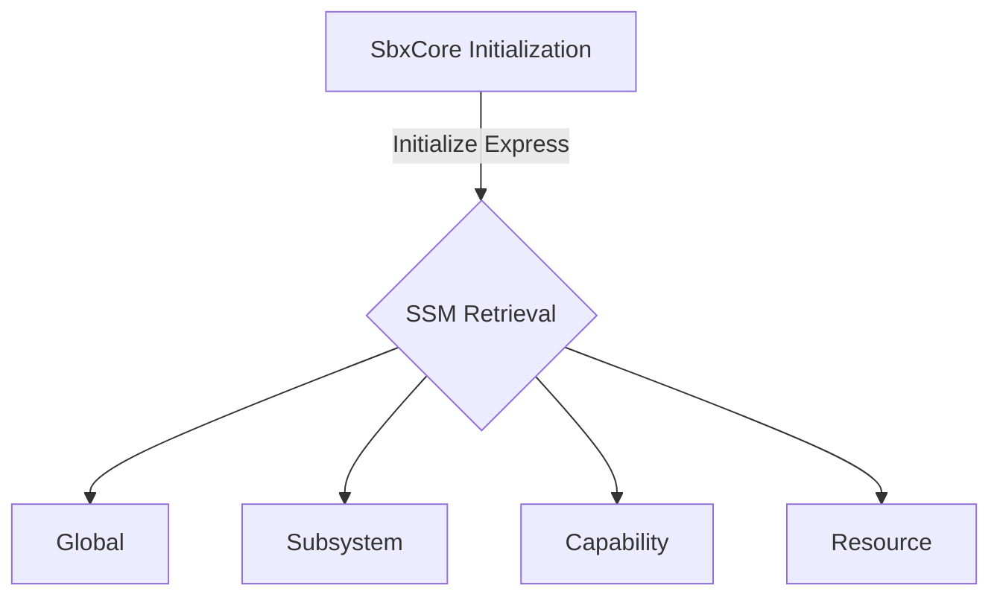

 

<!--MERMAID {width:100}-->

<!--MCONTENT {content: "graph TD \nA\\[SbxCore Initialization\\] \\-\\-\\>|Initialize Express| B{SSM Retrieval} \nB \\-\\-\\> C\\[Global\\] \nB \\-\\-\\> D\\[Subsystem\\] \nB \\-\\-\\> E\\[Capability\\] \nB \\-\\-\\> F\\[Resource\\]"} --->

 

This file was generated by Swimm. [Click here to view it in the app](https://app.swimm.io/repos/Z2l0aHViJTNBJTNBc3dpbW0tZGVtby1zZXJ2ZXIyJTNBJTNBcm9zcy1naWRlb24tYXN1cmlvbg==/docs/j84ks84w).

